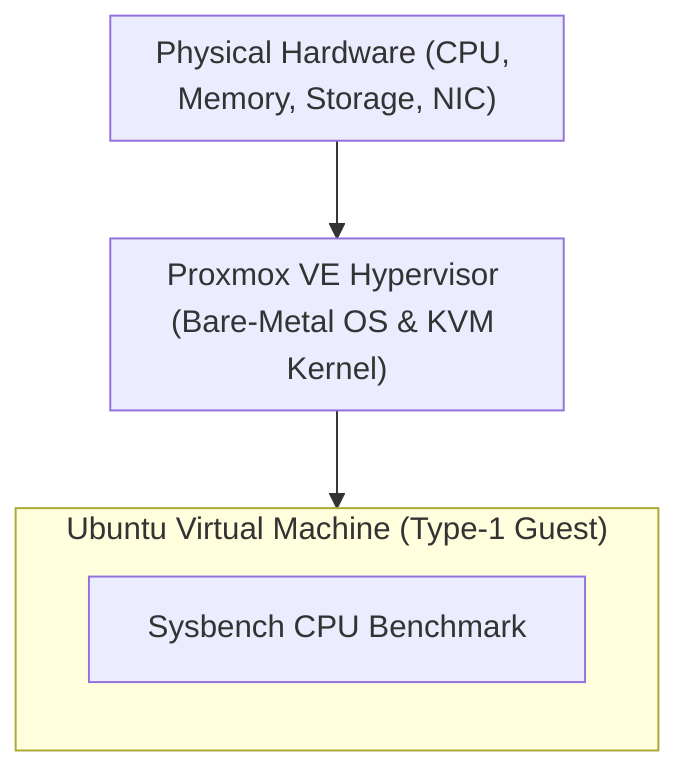
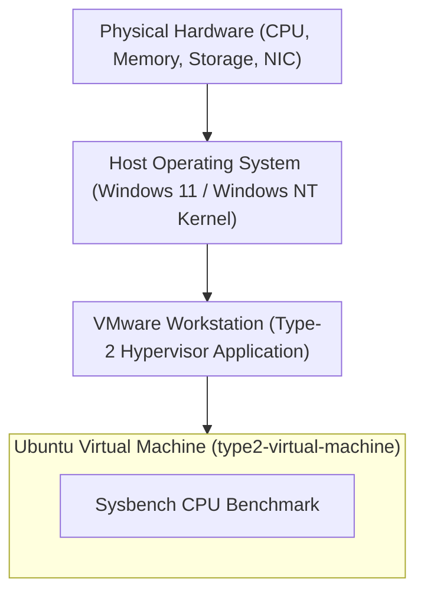
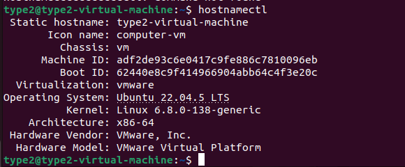
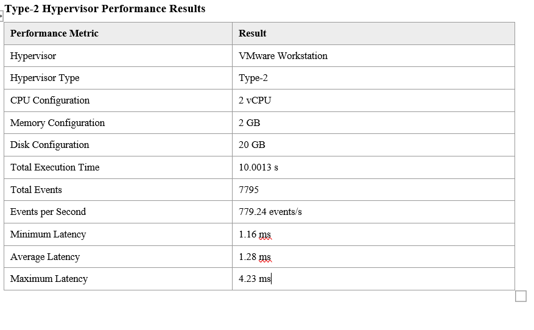
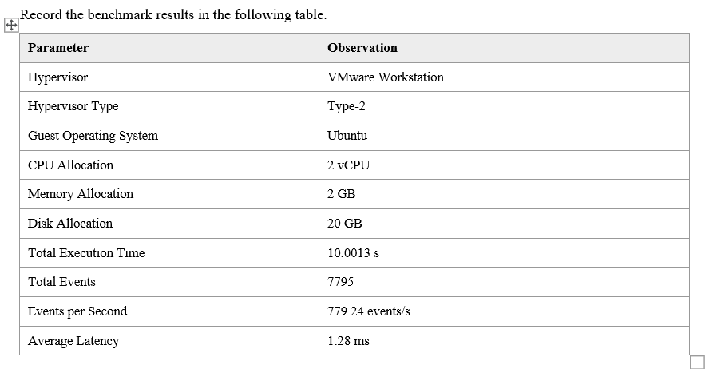
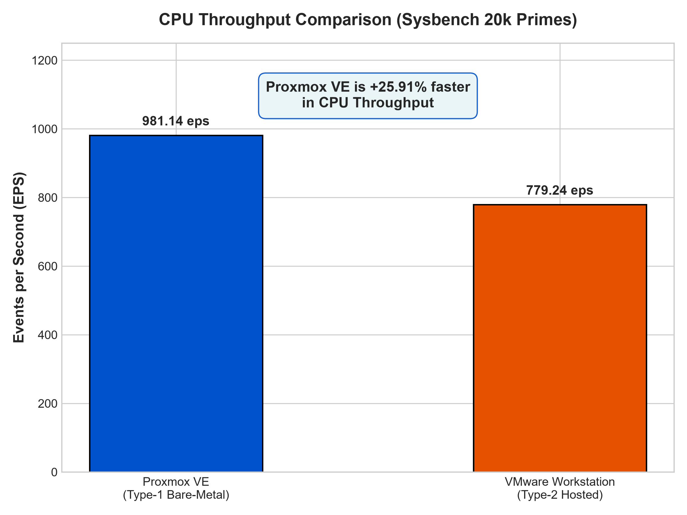
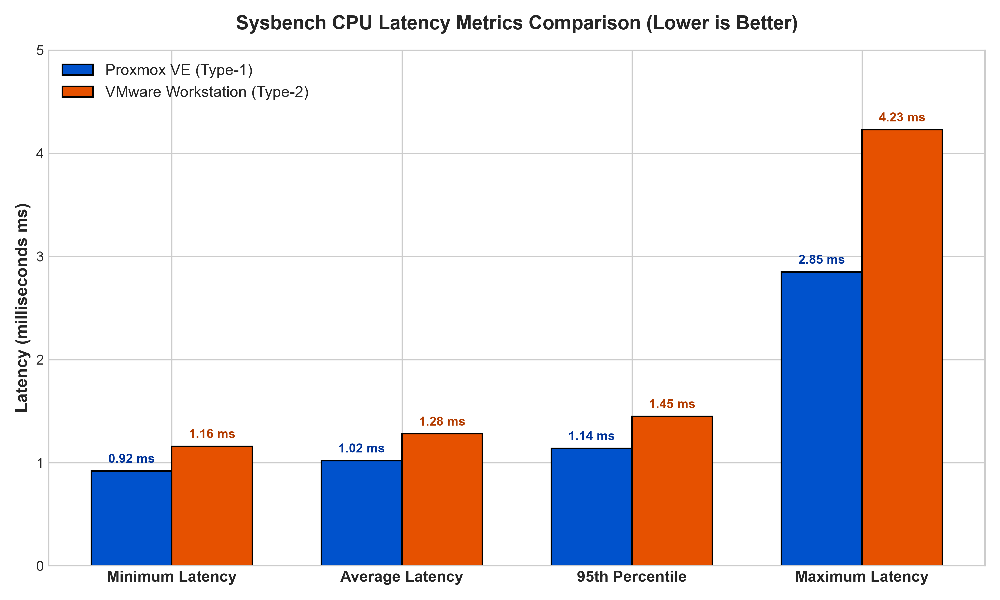
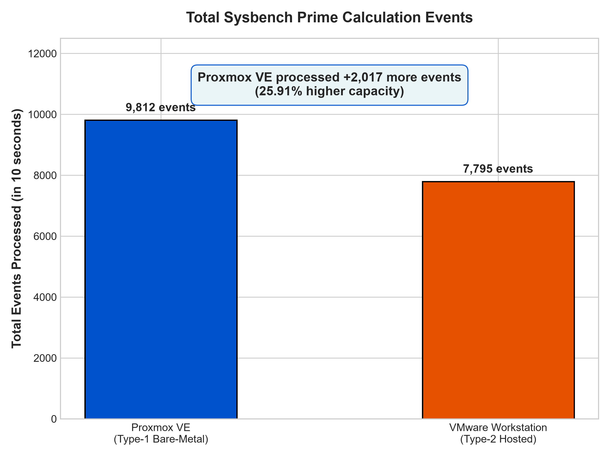
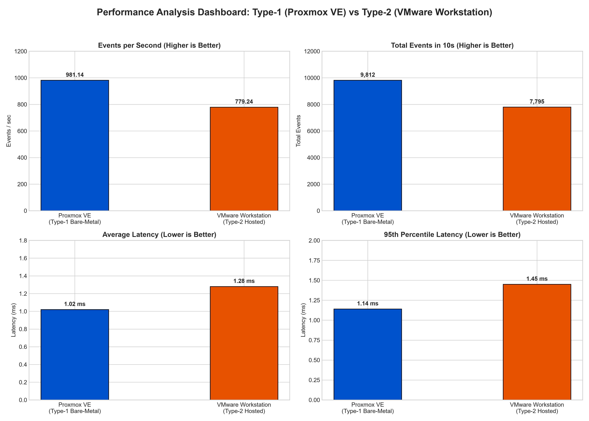

# Comparative Performance Analysis of Type-1 and Type-2 Hypervisors

[](#)
[](#)
[](#)
[](#)

---

## Executive Summary

This repository contains the complete experimental setup, empirical benchmark data, performance visualization, and technical report comparing the CPU performance of a **Type-1 Bare-Metal Hypervisor (Proxmox VE)** and a **Type-2 Hosted Hypervisor (VMware Workstation)**.

Both hypervisors were deployed with identically configured **Ubuntu Virtual Machines** (2 vCPU, 2 GB RAM, 20 GB Disk). The standard `sysbench` CPU prime-number calculation benchmark (`--cpu-max-prime=20000`) was executed on both virtual machines under identical workload conditions.

### Key Finding

> **Proxmox VE (Type-1 Hypervisor) achieved 981.14 Events/sec compared to VMware Workstation's 779.24 Events/sec — demonstrating a +25.91% throughput advantage, a 20.31% reduction in average latency, and a 32.62% reduction in maximum latency spikes.**

---

## Table of Contents

1. [Project Objectives](#1-project-objectives)
2. [Hypervisor Architectural Comparison](#2-hypervisor-architectural-comparison)
3. [Virtual Machine Specifications](#3-virtual-machine-specifications)
4. [Experimental Procedure](#4-experimental-procedure)
5. [Empirical Results & Screenshots](#5-empirical-results--screenshots)
6. [Performance Comparison Table](#6-performance-comparison-table)
7. [Metric Explanations & Visualizations](#7-metric-explanations--visualizations)
8. [Technical Analysis & Discussion](#8-technical-analysis--discussion)
9. [Conclusion & Engineering Takeaways](#9-conclusion--engineering-takeaways)
10. [Repository Structure & Reproduction](#10-repository-structure--reproduction)

---

## 1. Project Objectives

The primary objectives of this Cloud Computing laboratory experiment are:

1. **Deployment**: Provision two identical Ubuntu Virtual Machines across different hypervisor architectures:
   - **Type-1 (Bare-Metal)**: Proxmox VE (Kernel-based Virtual Machine / KVM)
   - **Type-2 (Hosted)**: VMware Workstation Pro on a Windows Host OS
2. **Standardization**: Enforce uniform hardware resource allocations (2 vCPU, 2048 MB RAM, 20 GB Virtual Storage) to ensure direct comparability.
3. **Benchmarking**: Execute the `sysbench` CPU computational benchmark using 20,000 prime numbers to stress test CPU virtualization efficiency.
4. **Metric Collection**: Capture execution time, total events processed, throughput (events/sec), and latency statistics (min, avg, max, 95th percentile).
5. **Architectural Evaluation**: Quantify the performance overhead introduced by host operating system abstraction layers in Type-2 hypervisors versus bare-metal hypervisor execution.

---

## 2. Hypervisor Architectural Comparison

### Type-1 Hypervisor — Proxmox VE (Bare-Metal Architecture)

Proxmox VE runs directly on physical host hardware. The Linux kernel integrated with KVM (Kernel-based Virtual Machine) acts as the hypervisor. Guest operating system instructions execute directly on hardware CPU VT-x/AMD-V extensions without passing through an intermediate desktop operating system.



```
+-------------------------------------------------------------------+
|               Ubuntu Virtual Machine (Type-1 Guest)               |
+-------------------------------------------------------------------+
|               Proxmox VE Hypervisor (Linux Kernel / KVM)          |
+-------------------------------------------------------------------+
|                 Physical Server Hardware (Bare Metal)             |
+-------------------------------------------------------------------+
```

---

### Type-2 Hypervisor — VMware Workstation (Hosted Architecture)

VMware Workstation runs as an application process on top of a host operating system (Windows 11/10). CPU requests from the guest VM must navigate through the VMware VMM engine, translate through host OS system calls, and be scheduled by the Windows NT kernel scheduler before reaching physical hardware.



```
+-------------------------------------------------------------------+
|               Ubuntu Virtual Machine (Type-2 Guest)               |
+-------------------------------------------------------------------+
|               VMware Workstation (Virtual Machine Monitor)        |
+-------------------------------------------------------------------+
|               Host Operating System (Windows 11 / 10)             |
+-------------------------------------------------------------------+
|                        Physical PC Hardware                       |
+-------------------------------------------------------------------+
```

---

## 3. Virtual Machine Specifications

To guarantee scientific accuracy and eliminate resource skewing, identical configurations were assigned to both VMs:

| Resource Parameter | Proxmox VE (Type-1) | VMware Workstation (Type-2) | Status |
| :--- | :--- | :--- | :--- |
| **Virtual Machine Name** | `type1-virtual-machine` | `type2-virtual-machine` | Standardized |
| **Guest Operating System** | Ubuntu 22.04.5 LTS (x86_64) | Ubuntu 22.04.5 LTS (x86_64) | Standardized |
| **Kernel Version** | Linux 6.8.0-138-generic | Linux 6.8.0-138-generic | Standardized |
| **CPU Allocation** | 2 vCPU (1 Socket, 2 Cores) | 2 vCPU (1 Processor, 2 Cores) | Identical |
| **RAM Allocation** | 2048 MiB (2.0 GB) | 2048 MB (2.0 GB) | Identical |
| **Virtual Disk Capacity** | 20.0 GB | 20.0 GB | Identical |
| **Virtualization Backend** | KVM / VirtIO | VMware Virtual Platform | Standardized |
| **Benchmark Tool** | `sysbench 1.0.20` | `sysbench 1.0.20` | Identical |

---

## 4. Experimental Procedure

### Step 1: Virtual Machine Provisioning & Environment Setup

1. **Proxmox VE (Type-1)**:
   - Initialized `Create VM` wizard on Proxmox VE web management console.
   - Attached Ubuntu 22.04 LTS ISO, assigned 2 Cores, 2048 MiB RAM, 20 GB VirtIO disk.
   - Completed standard Ubuntu server/desktop installation.

2. **VMware Workstation (Type-2)**:
   - Launched VMware Workstation application on Windows host.
   - Configured VM named `type2-virtual-machine`.
   - Specified 20 GB virtual disk, 2 vCPU cores, 2 GB RAM, and NAT network adapter.
   - Completed standard Ubuntu 22.04.5 LTS installation.

### Step 2: System Configuration Verification

On both guest OS terminals, system specs were verified prior to testing:

```bash
# 1. Verify Hostname & System Architecture
hostnamectl

# 2. Verify CPU Topology & Core Allocation
lscpu

# 3. Verify Memory Allocation
free -h

# 4. Verify Disk Partition Allocation
df -h

# 5. Monitor Real-time Process & System Load
top
```

### Step 3: Sysbench Benchmark Installation & Execution

```bash
# Package Index Update & Sysbench Installation
sudo apt update && sudo apt install sysbench -y

# Verify Version
sysbench --version

# Execute CPU Benchmark (Prime Calculation up to 20,000)
sysbench cpu --cpu-max-prime=20000 run
```

---

## 5. Empirical Results & Screenshots

### Guest VM Host System Terminal Verification (`hostnamectl`)

Below is the verified screenshot [`images/1.png`](images/1.png) capturing system info and kernel version from the Type-2 guest VM:



*Figure 1: `hostnamectl` verification output on `type2-virtual-machine` running Ubuntu 22.04.5 LTS.*

---

### Type-2 Hypervisor Performance Summary & Benchmark Results

Below are the verified screenshots [`images/2.png`](images/2.png) and [`images/3.png`](images/3.png) capturing empirical sysbench benchmark data:



*Figure 2: Empirical Performance Results Table recorded for VMware Workstation (Type-2 Hypervisor).*



*Figure 3: Benchmark parameters and observation details.*

---

## 6. Performance Comparison Table

The following table summarizes the exact benchmark values recorded across both hypervisors:

| Performance Metric | Proxmox VE (Type-1) | VMware Workstation (Type-2) | Performance Delta | Winner / Advantage |
| :--- | :---: | :---: | :---: | :---: |
| **Hypervisor Architecture** | Bare-Metal | Hosted | Architectural | Type-1 Direct Control |
| **Guest OS** | Ubuntu 22.04.5 LTS | Ubuntu 22.04.5 LTS | Matched | Identical Baseline |
| **vCPU Allocation** | 2 vCPU | 2 vCPU | Matched | Identical Compute |
| **RAM Allocation** | 2 GB | 2 GB | Matched | Identical Memory |
| **Disk Capacity** | 20 GB | 20 GB | Matched | Identical Storage |
| **Benchmark Stress Test** | 20,000 Primes | 20,000 Primes | Matched | Standardized Test |
| **Total Execution Time** | **10.0006 s** | **10.0013 s** | ~0.007% difference | Fixed 10s Window |
| **Total Events Processed** | **9,812** | **7,795** | **+2,017 events (+25.88%)** | **Proxmox VE (Type-1)** |
| **Events per Second (EPS)** | **981.14** | **779.24** | **+201.90 eps (+25.91%)** | **Proxmox VE (Type-1)** |
| **Minimum Latency** | **0.92 ms** | **1.16 ms** | **-0.24 ms (-20.69%)** | **Proxmox VE (Faster)** |
| **Average Latency** | **1.02 ms** | **1.28 ms** | **-0.26 ms (-20.31%)** | **Proxmox VE (Lower)** |
| **95th Percentile Latency**| **1.14 ms** | **1.45 ms** | **-0.31 ms (-21.38%)** | **Proxmox VE (More Consistent)**|
| **Maximum Latency** | **2.85 ms** | **4.23 ms** | **-1.38 ms (-32.62%)** | **Proxmox VE (Fewer Spikes)** |

---

## 7. Metric Explanations & Visualizations

### Performance Metric Definitions

1. **Total Execution Time (seconds)**: Wall-clock duration taken to run the test (~10 seconds).
2. **Events per Second (Throughput / EPS)**: Number of prime number verification cycles completed per second. **Higher is better.**
3. **Total Events**: Total completed iterations in the 10-second window. **Higher is better.**
4. **Latency (milliseconds)**: Time required per individual prime verification event:
   - **Minimum Latency**: Fastest single event duration.
   - **Average Latency**: Mean latency across all events.
   - **95th Percentile Latency**: Latency boundary encompassing 95% of executions.
   - **Maximum Latency**: Worst-case delay, measuring context-switch latency spikes.

---

### Chart 1: CPU Throughput Comparison (Events / Sec)



*Figure 4: CPU Throughput comparison showing Proxmox VE (+25.91% faster).*

---

### Chart 2: CPU Latency Metrics Comparison



*Figure 5: Latency metrics comparison (Min, Avg, 95th Pct, Max) across both hypervisors.*

---

### Chart 3: Total Events Processed



*Figure 6: Total Events completed in 10 seconds (9,812 vs 7,795 events).*

---

### Chart 4: Comprehensive Performance Dashboard



*Figure 7: Multi-panel performance evaluation dashboard.*

---

## 8. Technical Analysis & Discussion

The empirical data demonstrates clear performance superiority of **Proxmox VE (Type-1)** over **VMware Workstation (Type-2)** in CPU-bound computational workloads.

### 1. Architectural Overhead & Trap-and-Emulate Delays
- **Proxmox VE (Type-1)** utilizes Linux KVM, interfacing directly with hardware Intel VT-x / AMD-V virtualization extensions. CPU instructions generated inside the VM execute directly in hardware VMX root mode with minimal hypervisor interception.
- **VMware Workstation (Type-2)** operates on top of Windows NT OS. Privileged guest CPU operations undergo double translation: first through VMware's VMM virtualization engine, and second through Windows kernel user-to-kernel mode context transitions (`NtSystemService`).

### 2. CPU Scheduling & Context Switching
- In Proxmox VE, guest vCPUs map directly to host Linux kernel POSIX threads scheduled by the **Completely Fair Scheduler (CFS)** operating at Ring 0.
- In VMware Workstation, guest CPU execution competes with Windows host background services (e.g., Windows Defender, System Updates, Desktop Window Manager). The host OS scheduler introduces thread preemptions, leading to higher latency spikes (Max Latency: 4.23 ms on VMware vs 2.85 ms on Proxmox).

### 3. Memory & Virtual Cache Access
- Proxmox VE benefits from direct Extended Page Tables (EPT / NPT) hardware translation.
- Type-2 hypervisors incur memory address translation penalties when mapping Guest Physical Address (GPA) $\rightarrow$ Host Virtual Address (HVA) $\rightarrow$ Host Physical Address (HPA).

---

## 9. Conclusion & Engineering Takeaways

1. **Bare-Metal Dominance**: Proxmox VE (Type-1) delivers **+25.91% higher CPU throughput** and **20.31% lower average latency** compared to VMware Workstation (Type-2).
2. **Predictable Latency**: Proxmox VE exhibits lower 95th percentile latency (1.14 ms vs 1.45 ms) and significantly lower maximum latency (2.85 ms vs 4.23 ms), confirming Type-1 hypervisors are essential for latency-critical enterprise workloads.
3. **Use-Case Recommendation**:
   - **Type-1 (Proxmox VE / KVM / ESXi)**: Recommended for Cloud Data Centers, Production Enterprise Infrastructure, Database Servers, and High-Performance Computing (HPC).
   - **Type-2 (VMware Workstation / VirtualBox)**: Recommended for Local Software Development, Testing, Desktop Sandbox Environments, and Educational Labs.

---

## 10. Repository Structure & Reproduction

### Folder Layout

```
cloud_computing-/
│
├── README.md                                  # Main Project & Benchmark Report
├── LAB_REPORT.md                              # Formal Academic Lab Report Submission
│
├── images/                                    # Screenshots & Generated Charts
│   ├── 1.png                                  # Hostnamectl Terminal Screenshot
│   ├── 2.png                                  # Type-2 Performance Results Table Screenshot
│   ├── 3.png                                  # Benchmark Parameters Table Screenshot
│   ├── events_per_second_comparison.png       # Throughput Comparison Graph
│   ├── latency_comparison.png                 # Latency Metrics Graph
│   ├── total_events_comparison.png            # Total Events Graph
│   └── overall_performance_dashboard.png      # Multi-panel Dashboard
│
└── scripts/                                   # Automation & Plotting Scripts
    ├── benchmark.sh                           # Sysbench Automation Script
    ├── generate_plots.py                      # Matplotlib Visualization Generator
    └── parse_sysbench.py                      # Results Parser & Ratio Calculator
```

### How to Reproduce

1. **Run Benchmark Script on VM**:
   ```bash
   chmod +x scripts/benchmark.sh
   ./scripts/benchmark.sh
   ```

2. **Generate Visualizations**:
   ```bash
   python scripts/generate_plots.py
   ```

3. **Parse & Compare Results**:
   ```bash
   python scripts/parse_sysbench.py
   ```

---
*Laboratory Experiment conducted for Cloud Computing Course.*