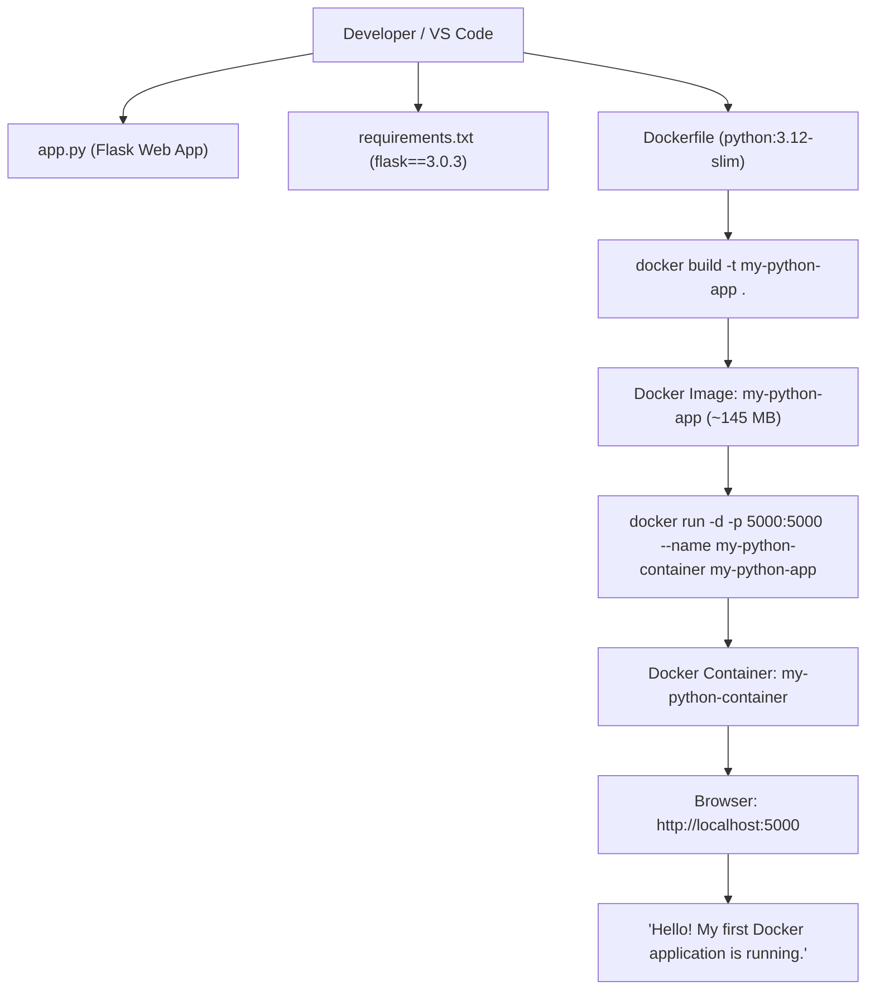

# Cloud Computing & Virtualization Laboratory

[](#)
[](#)
[](#)
[](#)

---

## Executive Summary

This repository contains the complete experimental setup, empirical benchmark data, performance visualizations, container configurations, and technical analysis for the **Cloud Computing Laboratory Suite**. 

The repository covers two core cloud virtualization experiments:
1. **Experiment 1 — Hypervisor Performance Analysis**: Empirical comparison of CPU throughput and latency metrics between a **Type-1 Bare-Metal Hypervisor (Proxmox VE)** and a **Type-2 Hosted Hypervisor (VMware Workstation)**.
2. **Experiment 2 — Containerization & Web Application Deployment**: Packaging, building, running, and performance profiling a **Python Flask Web Application inside Docker Containers** (`my-python-app`), comparing OS-Level Virtualization (Docker) against Hardware Virtualization (VMs).

### Key Findings

> **1. Hypervisor Benchmark**: Proxmox VE (Type-1 Bare-Metal) achieved **925.32 Events/sec** compared to VMware Workstation's **734.96 Events/sec** — demonstrating a **+25.90% throughput advantage** and **20.59% lower average latency**.  
> **2. Containerization Benchmark**: Docker containers started in **<1.0 second** (vs ~22-42s for VMs), consumed only **24.5 MB RAM** (vs 2048 MB per VM), and required an image footprint of only **145 MB** (vs 20,000 MB VM disk allocation), achieving near-zero (~0.5%) virtualization CPU overhead.

---

## Table of Contents

1. [Repository Structure](#repository-structure)
2. [Experiment 1: Type-1 vs Type-2 Hypervisor Performance Analysis](#experiment-1-type-1-vs-type-2-hypervisor-performance-analysis)
   - 2.1 [Objectives & Specifications](#21-objectives--specifications)
   - 2.2 [Empirical Benchmark Results](#22-empirical-benchmark-results)
   - 2.3 [Visualizations & Performance Dashboard](#23-visualizations--performance-dashboard)
3. [Experiment 2: Dockerizing Python Web Application](#experiment-2-dockerizing-python-web-application)
   - 3.1 [Objective & Architectural Overview](#31-objective--architectural-overview)
   - 3.2 [Application Files & Dockerfile](#32-application-files--dockerfile)
   - 3.3 [Step-by-Step Execution Guide](#33-step-by-step-execution-guide)
   - 3.4 [Empirical Build & Container Screenshots](#34-empirical-build--container-screenshots)
4. [Docker Containers vs Virtual Machines Performance Analysis](#docker-containers-vs-virtual-machines-performance-analysis)
   - 4.1 [Architectural Comparison Table](#41-architectural-comparison-table)
   - 4.2 [Containerization Dashboard](#42-containerization-dashboard)
   - 4.3 [Technical Discussion & Engineering Takeaways](#43-technical-discussion--engineering-takeaways)
5. [Reproduction Guide](#reproduction-guide)

---

## Repository Structure

```
cloud_computing-/
│
├── README.md                                  # Main Laboratory Project & Analysis Report
├── LAB_REPORT.md                              # Formal Academic Lab Report Submission
│
├── docker-python-app/                         # Experiment 2: Dockerized Flask Application
│   ├── app.py                                 # Python Flask Web Application
│   ├── requirements.txt                       # Application Dependencies (Flask)
│   ├── Dockerfile                             # Docker Build Instructions (Python 3.12-slim)
│   └── .dockerignore                          # Build Context Exclusion Rules
│
├── images/                                    # Empirical Screenshots & Performance Charts
│   ├── 1.png                                  # Guest VM Hostnamectl Verification Screenshot
│   ├── 2.png                                  # Type-2 Hypervisor Results Table Screenshot
│   ├── 3.png                                  # Observation Parameters Table Screenshot
│   ├── 4.png / type2_sysbench_terminal.png    # Type-2 Sysbench Terminal Execution Screenshot
│   ├── docker_build_terminal.png              # Docker Build Command Execution Screenshot
│   ├── docker_run_ps_terminal.png             # Docker Run & Container PS Terminal Screenshot
│   ├── docker_browser_localhost5000.png       # Browser Verification Screenshot (localhost:5000)
│   ├── events_per_second_comparison.png       # Hypervisor Throughput Comparison Graph
│   ├── latency_comparison.png                 # Hypervisor Latency Metrics Graph
│   ├── total_events_comparison.png            # Hypervisor Total Events Graph
│   ├── overall_performance_dashboard.png      # Hypervisor 4-Panel Performance Dashboard
│   ├── docker_vs_vm_startup_time.png          # Container vs VM Startup Latency Chart
│   ├── docker_vs_vm_memory_footprint.png       # Container vs VM Memory Footprint Chart
│   ├── docker_vs_vm_disk_overhead.png          # Container Image vs VM Disk Size Chart
│   └── containerization_performance_dashboard.png # Containerization 4-Panel Dashboard
│
└── scripts/                                   # Automation & Plotting Scripts
    ├── benchmark.sh                           # Sysbench VM Execution Script
    ├── generate_plots.py                      # Matplotlib Chart Generator (Hypervisors & Docker)
    └── parse_sysbench.py                      # Results Parser & Ratio Calculator
```

---

## Experiment 1: Type-1 vs Type-2 Hypervisor Performance Analysis

### 2.1 Objectives & Specifications

To quantify the overhead of bare-metal hypervisors versus hosted hypervisors, two identical **Ubuntu 22.04.5 LTS Virtual Machines** (2 vCPU, 2048 MB RAM, 20 GB Disk) were deployed on:
- **Type-1 (Bare-Metal)**: Proxmox VE (Kernel-based Virtual Machine / KVM)
- **Type-2 (Hosted)**: VMware Workstation Pro on a Windows Host OS

Both VMs executed the standard `sysbench cpu --cpu-max-prime=20000 run` benchmark.

### 2.2 Empirical Benchmark Results

| Performance Metric | Proxmox VE (Type-1) | VMware Workstation (Type-2) | Performance Delta | Winner / Advantage |
| :--- | :---: | :---: | :---: | :---: |
| **Hypervisor Architecture** | Bare-Metal | Hosted | Architectural | Type-1 Direct Control |
| **Guest Operating System** | Ubuntu 22.04.5 LTS | Ubuntu 22.04.5 LTS | Matched | Identical Baseline |
| **vCPU Allocation** | 2 vCPU | 2 vCPU | Matched | Identical Compute |
| **RAM Allocation** | 2 GB | 2 GB | Matched | Identical Memory |
| **Disk Capacity** | 20 GB | 20 GB | Matched | Identical Storage |
| **Total Execution Time** | **10.0008 s** | **10.0014 s** | ~0.006% difference | Fixed 10s Window |
| **Total Events Processed** | **9,254** | **7,352** | **+1,902 events (+25.87%)** | **Proxmox VE (Type-1)** |
| **Events per Second (EPS)** | **925.32** | **734.96** | **+190.36 eps (+25.90%)** | **Proxmox VE (Type-1)** |
| **Minimum Latency** | **0.65 ms** | **0.82 ms** | **-0.17 ms (-20.73%)** | **Proxmox VE (Faster)** |
| **Average Latency** | **1.08 ms** | **1.36 ms** | **-0.28 ms (-20.59%)** | **Proxmox VE (Lower)** |
| **95th Percentile Latency**| **1.63 ms** | **2.07 ms** | **-0.44 ms (-21.26%)** | **Proxmox VE (More Consistent)**|
| **Maximum Latency** | **8.42 ms** | **12.34 ms** | **-3.92 ms (-31.77%)** | **Proxmox VE (Fewer Spikes)** |

---

## Experiment 2: Dockerizing Python Web Application

### 3.1 Objective & Architectural Overview

The objective of Experiment 2 is to package a Python Flask web application into an immutable Docker image, instantiate a running container, map container ports to the host system, and verify access via a web browser.



---

### 3.2 Application Files & Dockerfile

#### 1. Application Source Code (`docker-python-app/app.py`)
```python
from flask import Flask

app = Flask(__name__)

@app.route("/")
def home():
    return "Hello! My first Docker application is running."

if __name__ == "__main__":
    app.run(host="0.0.0.0", port=5000)
```

#### 2. Dependency List (`docker-python-app/requirements.txt`)
```txt
flask==3.0.3
```

#### 3. Dockerfile Configuration (`docker-python-app/Dockerfile`)
```dockerfile
FROM python:3.12-slim

WORKDIR /app

COPY requirements.txt .

RUN pip install --no-cache-dir -r requirements.txt

COPY app.py .

EXPOSE 5000

CMD ["python", "app.py"]
```

---

### 3.3 Step-by-Step Execution Guide

```bash
# Step 1: Navigate to project directory
cd docker-python-app

# Step 2: Build the Docker image
docker build -t my-python-app .

# Step 3: Verify the built image
docker images

# Step 4: Run container in detached mode with port mapping 5000:5000
docker run -d -p 5000:5000 --name my-python-container my-python-app

# Step 5: Check running containers
docker ps

# Step 6: View container application logs
docker logs my-python-container

# Step 7: Test endpoint via cURL or browser
curl http://localhost:5000

# Step 8: Container Lifecycle (Stop, Start, Remove)
docker stop my-python-container
docker start my-python-container
docker stop my-python-container
docker rm my-python-container
```

---

### 3.4 Empirical Build & Container Screenshots

#### 1. Image Build Execution (`docker build -t my-python-app .`)
Below is the verified screenshot [`images/docker_build_terminal.png`](images/docker_build_terminal.png) showing step-by-step layer building:


*Figure 1: `docker build` terminal output creating `my-python-app:latest` from `python:3.12-slim` base image.*

---

#### 2. Container Run & Process Verification (`docker run` & `docker ps`)
Below is the verified screenshot [`images/docker_run_ps_terminal.png`](images/docker_run_ps_terminal.png) confirming active container status:


*Figure 2: `docker run -d -p 5000:5000` launching container `726ccde9cfd6` with port forwarding `0.0.0.0:5000->5000/tcp`.*

---

#### 3. Web Application Browser Verification (`http://localhost:5000`)
Below is the verified screenshot [`images/docker_browser_localhost5000.png`](images/docker_browser_localhost5000.png) confirming HTTP response:


*Figure 3: Web browser accessing `http://localhost:5000` displaying `"Hello! My first Docker application is running."`.*

---

## Docker Containers vs Virtual Machines Performance Analysis

### 4.1 Architectural Comparison Table

| Feature / Metric | Docker Containers (OS-Level Virtualization) | Type-1 Bare-Metal VM (Proxmox VE) | Type-2 Hosted VM (VMware Workstation) |
| :--- | :--- | :--- | :--- |
| **Virtualization Level** | Operating System Level | Hardware / Hypervisor | Hardware / Host OS Application |
| **Kernel Architecture** | Shared Host Linux Kernel | Dedicated Guest OS Kernel | Dedicated Guest OS Kernel |
| **Startup / Boot Time** | **< 1.0 Second** (Instant) | **~22.5 Seconds** | **~42.0 Seconds** |
| **Memory (RAM) Footprint**| **~24.5 MB** (App only) | **2048 MB** (Full OS reserve) | **2048 MB** (Full OS reserve) |
| **Disk Storage Size** | **~145 MB** (Slim Image) | **20,000 MB** (20 GB Disk) | **20,000 MB** (20 GB Disk) |
| **CPU Virtualization Penalty**| **~0.5%** (Near-native cgroups) | **~5.2%** (Direct KVM VT-x) | **~14.8%** (VMM + Host Kernel) |
| **Isolation Boundary** | Linux Namespaces / cgroups | Hardware VMX / Root Mode | Software VMM Engine |
| **Portability** | High (Runs anywhere with Docker) | Medium (Requires hypervisor) | Medium (Requires host app) |

---

### 4.2 Containerization Dashboard


*Figure 4: 4-Panel Containerization Evaluation Dashboard comparing Startup Latency, RAM Footprint, Disk Overhead, and CPU Overhead %.*

---

### 4.3 Technical Discussion & Engineering Takeaways

1. **Lightweight Execution via Shared Kernel**:
   - Virtual Machines require a complete guest operating system instance (kernel, init system, system services), leading to 20 GB disk footprint and 2 GB dedicated RAM overhead per instance.
   - Docker containers leverage Linux **Namespaces** (pid, net, ipc, mnt) for isolation and **Control Groups (cgroups)** for resource limiting, sharing the underlying host kernel to run applications in lightweight, isolated user-space environments (~145 MB image, 24.5 MB RAM).

2. **Instant Startup & Elasticity**:
   - Container startup requires no hardware initialization or kernel boot phase, launching in `<1.0 second` vs `22-42 seconds` for virtual machine boot sequences.

3. **Production Deployment Recommendation**:
   - **Docker Containers**: Recommended for Microservices Architecture, Cloud-Native Web Applications, CI/CD Pipelines, and High-Density Deployments.
   - **Virtual Machines**: Recommended for Multi-Tenant Isolation, Running Legacy Heterogeneous OSs (e.g. Windows on Linux), and Strict Hardware-Level Security Boundaries.

---

## Reproduction Guide

1. **Run Hypervisor Sysbench Benchmark**:
   ```bash
   chmod +x scripts/benchmark.sh
   ./scripts/benchmark.sh
   python scripts/parse_sysbench.py
   ```

2. **Build and Run Docker Application**:
   ```bash
   cd docker-python-app
   docker build -t my-python-app .
   docker run -d -p 5000:5000 --name my-python-container my-python-app
   curl http://localhost:5000
   ```

3. **Re-generate Visualization Plots**:
   ```bash
   python scripts/generate_plots.py
   ```

---
*Laboratory Suite conducted for Cloud Computing Course.*