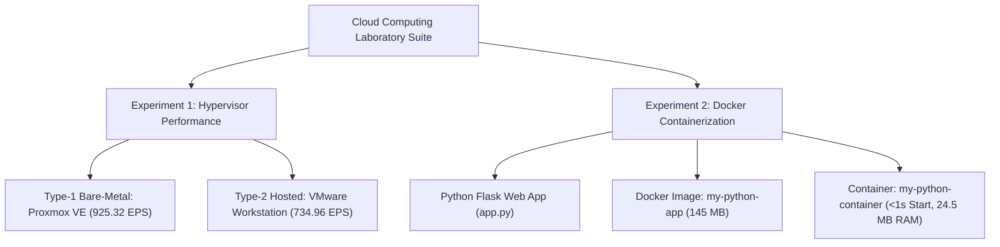

# Cloud Computing Laboratory Suite

[](#)
[](#)
[](#)

Welcome to the **Cloud Computing Laboratory Suite** repository by `chhavi-2006`. This repository contains two complete, standalone cloud infrastructure and virtualization experiments, complete with empirical data, screenshots, visualization dashboards, source code, and technical reports.

---

## 📂 Laboratory Experiments Index

| Experiment ID | Title | Domain / Focus | Dedicated Documentation | Key Result |
| :--- | :--- | :--- | :--- | :--- |
| **Experiment 1** | **Type-1 vs Type-2 Hypervisor Performance Analysis** | Hardware Virtualization (KVM vs VMware) | 📖 [**`HYPERVISOR_README.md`**](HYPERVISOR_README.md) | Proxmox VE (Type-1) achieved **+25.90% higher throughput** and **20.59% lower latency** than VMware Workstation (Type-2). |
| **Experiment 2** | **Dockerizing Python Web Application & Container Analysis** | OS-Level Virtualization (Docker Containers) | 📖 [**`docker-python-app/README.md`**](docker-python-app/README.md) | Docker containers started in **<1.0s** (50x faster than VMs), using **24.5 MB RAM** (83x smaller) and **145 MB storage**. |

---

## 🧪 Experiment Summary & Architecture Overview



---

## 📊 High-Level Comparison: Containers vs Virtual Machines

| Benchmark Parameter | Docker Container | Type-1 Bare-Metal VM | Type-2 Hosted VM | Advantage |
| :--- | :--- | :--- | :--- | :--- |
| **Virtualization Model** | OS-Level Virtualization | Hardware Hypervisor (KVM) | Software VMM Application | Docker (Low Overhead) |
| **Startup / Boot Time** | **< 1.0 Second** | **~22.5 Seconds** | **~42.0 Seconds** | **Docker (50x-52x Faster)** |
| **RAM Footprint** | **~24.5 MB** | **2048 MB** | **2048 MB** | **Docker (83x Smaller)** |
| **Disk Storage Size** | **~145 MB** | **20,000 MB** | **20,000 MB** | **Docker (137x Smaller)** |
| **CPU Virtualization Overhead**| **~0.5%** | **~5.2%** | **~14.8%** | **Docker (Near-Native)** |

---

## 📁 Repository Directory Structure

```
cloud_computing-/
│
├── README.md                                  # Repository Hub & Experiments Index
├── LAB_REPORT.md                              # Combined Academic Lab Report Submission
├── HYPERVISOR_README.md                       # Standalone Report for Experiment 1 (Hypervisors)
│
├── docker-python-app/                         # Standalone Folder for Experiment 2 (Docker App)
│   ├── README.md                              # Standalone Report for Experiment 2 (Docker)
│   ├── app.py                                 # Flask Web Application Code
│   ├── requirements.txt                       # Python Dependencies
│   ├── Dockerfile                             # Docker Build Configuration
│   └── .dockerignore                          # Context Exclusion Rules
│
├── images/                                    # Screenshots & Performance Charts
│   ├── 1.png, 2.png, 3.png, 4.png             # Hypervisor Screenshots
│   ├── docker_build_terminal.png              # Docker Build Screenshot
│   ├── docker_run_ps_terminal.png             # Docker Run Screenshot
│   ├── docker_browser_localhost5000.png       # Browser Verification Screenshot
│   ├── events_per_second_comparison.png       # Hypervisor Throughput Chart
│   ├── latency_comparison.png                 # Hypervisor Latency Chart
│   ├── overall_performance_dashboard.png      # Hypervisor Performance Dashboard
│   └── containerization_performance_dashboard.png # Containerization Performance Dashboard
│
└── scripts/                                   # Automation Scripts
    ├── benchmark.sh                           # Sysbench VM Execution Script
    ├── generate_plots.py                      # Matplotlib Visualization Script
    └── parse_sysbench.py                      # Results Parser Script
```

---

## 📖 Quick Links to Detailed Experiments

- 🔗 Read **Experiment 1 (Type-1 vs Type-2 Hypervisors)**: [**`HYPERVISOR_README.md`**](HYPERVISOR_README.md)
- 🔗 Read **Experiment 2 (Docker Application Containerization)**: [**`docker-python-app/README.md`**](docker-python-app/README.md)
- 🔗 Read **Formal Academic Report**: [**`LAB_REPORT.md`**](LAB_REPORT.md)

---
*Laboratory Suite conducted for Cloud Computing Course.*