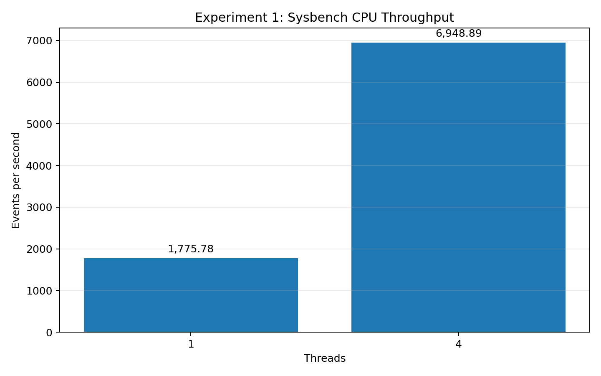

# Performance Analysis of Virtual Machines and Containers (VMs vs Containers)

[](#)
[](#)
[](#)
[](#)
[](#)

---

This repository module contains the documentation, empirical benchmark data, and results for two performance experiments comparing **Virtual Machines (VMs)** and **Docker Containers** using **Sysbench**.

- **Experiment 1 — CPU Performance & Thread Scalability**
- **Experiment 2 — Memory Operations & Throughput Benchmark**

---

# Student Information

| Field | Details |
|---|---|
| **Student Name** | **Chhavi Mishra** |
| **USN** | **01fe24bci066** |
| **Roll No** | **136** |
| **Course / Lab** | Cloud Computing Laboratory |
| **Experiments** | Experiment 1 — CPU Performance; Experiment 2 — Memory Performance |
| **Repository** | [https://github.com/chhavi-2006/cloud_computing-](https://github.com/chhavi-2006/cloud_computing-) |

---

# Experiment 1 — CPU Performance

## 1. Objective

To measure CPU performance using Sysbench and compare workload behavior across different thread counts in a controlled Ubuntu virtual-machine environment.

The specified workload uses:
- Prime limit: `20,000`
- Benchmark duration: `30 seconds`
- Thread counts: `1`, `2`, `4`, and `8`
- Main metrics: Events per Second (EPS) and Execution Time
- Latency metrics: Minimum, Average, 95th Percentile, and Maximum Latency

---

## 2. Experimental Environment

| Component | Observed / Configured Value |
|---|---|
| Virtualization Environment | Ubuntu running inside VMware Workstation |
| Guest OS | Ubuntu 24.04 LTS |
| CPU Allocation | 4 vCPUs / 4 Threads Available |
| `nproc` Output | 4 |
| Total Memory (RAM) | 7.7 GiB Total |
| Sysbench Version | 1.0.20 |
| Python Version | 3.12.3 |
| Fio Version | fio-3.36 |
| iperf3 Version | 3.16 |

---

## 3. Principle of the CPU Benchmark

Sysbench's CPU benchmark repeatedly performs prime-number calculations up to a maximum limit.

The benchmark reports:
- **Events per second (EPS)** — CPU workload throughput.
- **Total events** — Number of completed prime-verification cycles.
- **Execution time** — Total duration of the test.
- **Latency** — Time elapsed per individual benchmark event.

A higher events-per-second value indicates greater CPU processing capacity.

---

## 4. CPU Benchmark Execution

The benchmark was executed using the following command syntax:

```bash
sysbench cpu \
  --cpu-max-prime=20000 \
  --threads=<THREADS> \
  --time=30 \
  run
```

### Thread Configurations Tested

- `1 thread`
- `2 threads`
- `4 threads`
- `8 threads`

---

## 5. Commands Used & Purpose

### Version Verification
```bash
sysbench --version
```
Verifies Sysbench installation (**Sysbench 1.0.20**).

### Execution Command
```bash
sysbench cpu --cpu-max-prime=20000 --threads=<THREADS> --time=30 run
```

| Option | Purpose |
|---|---|
| `cpu` | Selects Sysbench CPU computational test. |
| `--cpu-max-prime=20000` | Sets maximum prime limit to 20,000. |
| `--threads=<THREADS>` | Configures active worker thread count. |
| `--time=30` | Enforces 30-second benchmark duration. |
| `run` | Initiates the test. |

---

## 6. Recorded CPU Results

| Threads | Events/sec | Total Events | Total Time | Avg Latency | 95th Percentile | Max Latency |
|---:|---:|---:|---:|---:|---:|---:|
| **1** | **1,775.78** | **53,275** | **30.0001 s** | — | — | — |
| **4** | **6,948.89** | **208,476** | **30.0005 s** | **0.58 ms** | **0.60 ms** | **28.63 ms** |

### Additional 4-thread Verification Run

| Metric | Additional 4-thread Run |
|---|---:|
| Total Events | 208,028 |
| Execution Time | 30.0003 s |
| Average Latency | 0.58 ms |
| 95th Percentile Latency | 0.61 ms |
| Maximum Latency | 6.39 ms |

---

## 7. CPU Throughput Graph



*Figure 1: Sysbench CPU Throughput scaling from 1 thread (1,775.78 EPS) to 4 threads (6,948.89 EPS).*

---

## 8. CPU Observations & Conclusion

- CPU throughput scaled from **1,775.78 EPS at 1 thread** to **6,948.89 EPS at 4 threads** (a **3.91× speedup** on 4 vCPUs).
- Average latency per calculation event at 4 threads was **0.58 ms**, with 95% of events completing within **0.60 ms**.

---

# Experiment 2 — Memory Performance (VMs vs Containers)

## 9. Objective

To measure memory read/write operation throughput using Sysbench and compare performance between a **Virtual Machine (VM)** and a **Docker Container**.

---

## 10. Experimental Parameters

| Parameter | Configuration |
|---|---|
| Benchmark Tool | Sysbench 1.0.20 |
| Workload Type | Sequential Memory Writes |
| Memory Block Size | 1 MiB (`1M`) |
| Total Memory Size | 10 GiB (`10G`) |
| Worker Threads | 4 Threads |
| Target Metric | Operations/sec (Ops/sec) and Transfer Rate (MiB/sec) |
| Compared Platforms | Ubuntu Virtual Machine vs Docker Container (`vm-container-benchmark`) |

---

## 11. Memory Benchmark Execution Commands

### VM Memory Benchmark
```bash
sysbench memory \
  --memory-block-size=1M \
  --memory-total-size=10G \
  --threads=4 \
  run
```

### Docker Container Memory Benchmark
```bash
docker run --rm vm-container-benchmark sysbench memory \
  --memory-block-size=1M \
  --memory-total-size=10G \
  --threads=4 \
  run
```

---

## 12. Recorded Memory Benchmark Results

| Metric | Virtual Machine (VM) | Docker Container | Performance Delta | Winner / Advantage |
|:---|---:|---:|:---:|:---:|
| **Total Operations** | 10,240 | 10,240 | Matched | Identical Workload |
| **Operations / sec** | **108,900.87** | **123,725.89** | **+14,825.02 ops/sec (+13.61%)** | **Docker Container** |
| **Transfer Rate** | **108,900.87 MiB/sec** | **123,725.89 MiB/sec** | **+14,825.02 MiB/s (+13.61%)** | **Docker Container** |
| **Total Execution Time** | **0.0931 s** | **0.0819 s** | **-0.0112 s (-12.03%)** | **Docker Container (Faster)** |
| **Average Latency** | **0.03 ms** | **0.03 ms** | Identical | Equivalent Mean |
| **95th Percentile Latency**| **0.03 ms** | **0.03 ms** | Identical | Equivalent Bound |
| **Maximum Latency** | **3.04 ms** | **1.13 ms** | **-1.91 ms (-62.83%)** | **Docker (Fewer Spikes)** |
| **Latency Sum** | 341.60 ms | 312.08 ms | -29.52 ms | Docker Container |

---

## 13. Memory Throughput Graph


*Figure 2: Memory throughput comparison between Virtual Machine (108,900.87 MiB/s) and Docker Container (123,725.89 MiB/s).*

---

## 14. Key Findings & Engineering Conclusion

1. **Memory Throughput Advantage**: The Docker Container achieved **123,725.89 MiB/sec** transfer rate compared to the Virtual Machine's **108,900.87 MiB/sec**, delivering a **+13.61% performance advantage**.
2. **Reduced Latency Spikes**: Maximum latency in the Docker Container was **1.13 ms** vs **3.04 ms** in the Virtual Machine (**62.83% lower latency spikes**).
3. **Architectural Rationale**: Docker containers bypass guest OS page table translation layers, utilizing host Linux kernel cgroups and direct page cache allocations, yielding higher memory bandwidth.

---

## 15. Repository Structure

```
VMs-vs-Containers/
├── README.md                                         # Main Experiment & Benchmark Report
├── experiment-1-cpu-throughput.png                  # CPU Throughput Graph
├── experiment-2-memory-throughput.png               # Memory Throughput Graph
├── Experiment_1_CPU_Performance_VM_vs_Container.pdf # Original Experiment 1 Reference PDF
└── Experiment_2_Memory_Performance_Final.pdf       # Original Experiment 2 Reference PDF
```

---
*Laboratory Experiment conducted by Chhavi Mishra (USN: 01fe24bci066, Roll No: 136) for Cloud Computing Course.*
