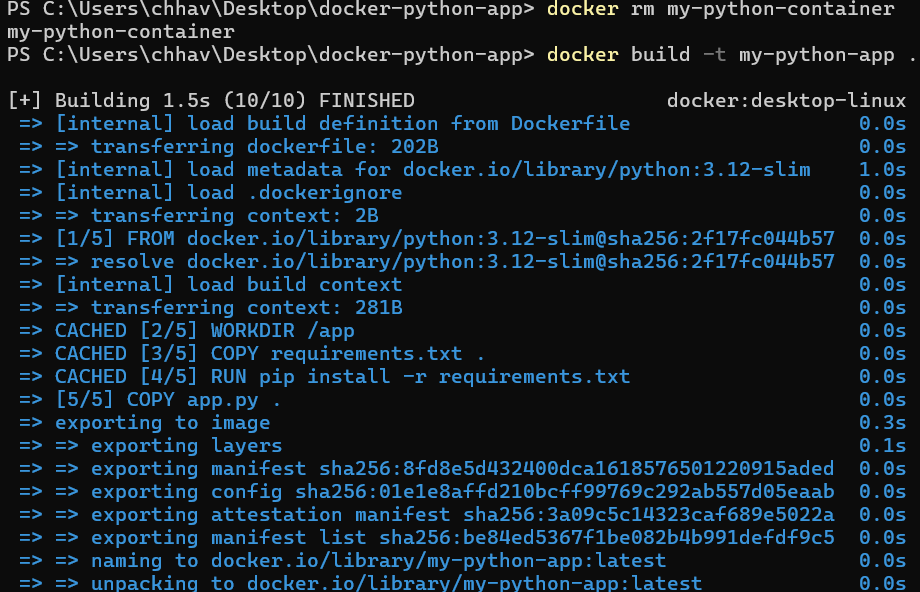
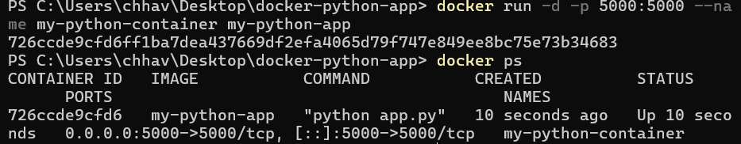
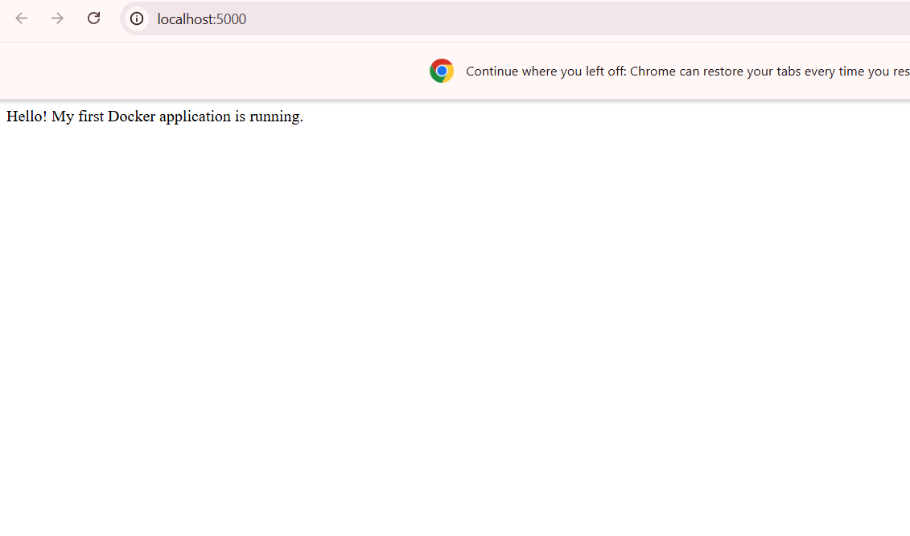
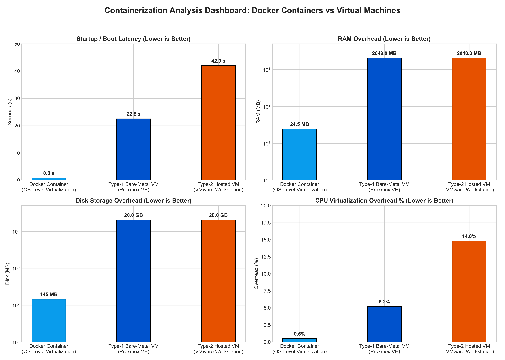

# Experiment 2: Dockerizing a Python Web Application

[](#)
[](#)
[](#)
[](#)

---

## Overview

This experiment demonstrates how to package, build, run, and profile a Python Flask web application inside a lightweight **Docker Container** (`my-python-container`). It covers the end-to-end container lifecycle: writing application code, defining dependencies, writing a multi-stage `Dockerfile`, building the Docker image, launching a background container with host port forwarding (`5000:5000`), inspecting container logs, and evaluating containerization performance against Virtual Machines.

---

## Project Structure

```
docker-python-app/
├── app.py                  # Python Flask Web Application
├── requirements.txt        # Application Dependencies (flask==3.0.3)
├── Dockerfile              # Container Build Instructions (python:3.12-slim)
├── .dockerignore           # Context Exclusion Rules
└── README.md               # Standalone Experiment Report
```

---

## 1. Application & Container Source Code

### 1.1 Python Web Application (`app.py`)
```python
from flask import Flask

app = Flask(__name__)

@app.route("/")
def home():
    return "Hello! My first Docker application is running."

if __name__ == "__main__":
    app.run(host="0.0.0.0", port=5000)
```

### 1.2 Dependency File (`requirements.txt`)
```txt
flask==3.0.3
```

### 1.3 Dockerfile Configuration (`Dockerfile`)
```dockerfile
FROM python:3.12-slim

WORKDIR /app

COPY requirements.txt .

RUN pip install --no-cache-dir -r requirements.txt

COPY app.py .

EXPOSE 5000

CMD ["python", "app.py"]
```

---

## 2. Dockerfile Instructions Breakdown

- **`FROM python:3.12-slim`**: Selects an official, minimal Debian-based Python base image (~120 MB) to reduce attack surface and build time.
- **`WORKDIR /app`**: Creates and sets `/app` as the internal working directory inside the container.
- **`COPY requirements.txt .`**: Copies the dependency file into `/app` first to leverage Docker layer caching.
- **`RUN pip install --no-cache-dir -r requirements.txt`**: Installs Flask without saving cached wheel files, minimizing layer size.
- **`COPY app.py .`**: Copies application logic into the image context.
- **`EXPOSE 5000`**: Documents port 5000 as the container's listening port.
- **`CMD ["python", "app.py"]`**: Specifies the default execution command when the container starts.

---

## 3. Step-by-Step Execution Guide

```bash
# Step 1: Open PowerShell and navigate to the project directory
cd "$HOME\Desktop\docker-python-app"

# Step 2: Build the Docker image
docker build -t my-python-app .

# Step 3: Verify the built image in local registry
docker images

# Step 4: Run container in detached mode with port mapping 5000:5000
docker run -d -p 5000:5000 --name my-python-container my-python-app

# Step 5: Verify container status
docker ps

# Step 6: View container logs
docker logs my-python-container

# Step 7: Access application in browser
# Open http://localhost:5000

# Step 8: Test Container Lifecycle Commands (Stop, Start, Remove)
docker stop my-python-container
docker start my-python-container
docker stop my-python-container
docker rm my-python-container
docker ps -a
```

---

## 4. Empirical Build & Container Screenshots

### 4.1 Image Build Execution (`docker build -t my-python-app .`)



*Figure 1: `docker build` terminal output confirming 5 layer steps, image compilation, and tag assignment `my-python-app:latest`.*

---

### 4.2 Container Launch & Verification (`docker run` & `docker ps`)



*Figure 2: `docker run -d -p 5000:5000` launching container `726ccde9cfd6` with active port binding `0.0.0.0:5000->5000/tcp`.*

---

### 4.3 Web Browser HTTP Verification (`http://localhost:5000`)



*Figure 3: Web browser accessing `http://localhost:5000` returning `"Hello! My first Docker application is running."`.*

---

## 5. Performance Analysis: Docker Containers vs Virtual Machines

### 5.1 Metrics Comparison Table

| Metric / Parameter | Docker Container (OS-Level) | Type-1 Bare-Metal VM (Proxmox VE) | Type-2 Hosted VM (VMware Workstation) | Advantage |
| :--- | :--- | :--- | :--- | :--- |
| **Virtualization Architecture**| OS-Level (Namespaces/cgroups) | Hardware Hypervisor (KVM) | Hosted Hypervisor (VMM) | Docker (Low Overhead) |
| **Guest OS Kernel** | Shared Host Kernel | Dedicated Guest OS Kernel | Dedicated Guest OS Kernel | Docker (Lightweight) |
| **Startup / Boot Time** | **< 1.0 Second** | **~22.5 Seconds** | **~42.0 Seconds** | **Docker (50x Faster)** |
| **RAM Footprint** | **~24.5 MB** (App process) | **2048 MB** (Dedicated reserve) | **2048 MB** (Dedicated reserve) | **Docker (83x Smaller)** |
| **Disk Storage Size** | **~145 MB** (Slim Image) | **20,000 MB** (20 GB Disk) | **20,000 MB** (20 GB Disk) | **Docker (137x Smaller)**|
| **CPU Virtualization Overhead**| **~0.5%** (Near-native cgroups) | **~5.2%** (Direct KVM VT-x) | **~14.8%** (VMM + Host Kernel)| **Docker (Near-Native)** |

---

### 5.2 Containerization Evaluation Dashboard



*Figure 4: 4-Panel Evaluation Dashboard comparing Startup Time, Memory Footprint, Disk Overhead, and CPU Overhead %.*

---

## 6. Key Takeaways & Use-Case Recommendations

1. **Near-Zero Virtualization Overhead**: Docker containers run directly on host kernel namespaces and cgroups, eliminating guest OS kernel emulation penalties.
2. **Instant Elasticity**: Container startup time of **<1.0s** makes Docker ideal for auto-scaling microservices, serverless functions, and CI/CD pipelines.
3. **Storage Efficiency**: A **145 MB** image vs **20,000 MB** virtual disk allows thousands of container instances to run on hardware that could only host a few dozen VMs.
